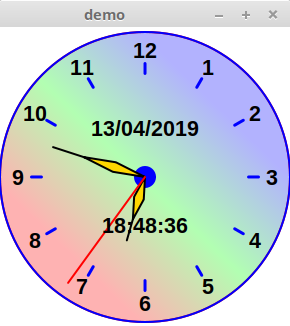

 
# RktAlarmClock
## subject

little alarmclock in Racket to compare with [Julia one](https://github.com/nodrygo/jAnalogAlarmClock)   

## instal

No binary provided so please install [Racket](https://racket-lang.org/)

then run either in DrRacket and compile for your platform if needed   

# to do
alarm part 
right click menu  (set alarm / Resize / move / quit)
suppress win border
adjust hour pos according past minutes [DONE]
see better gradiant when resize [DONE]